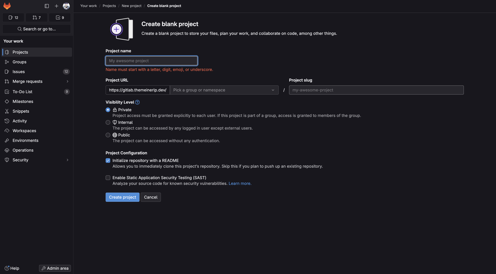
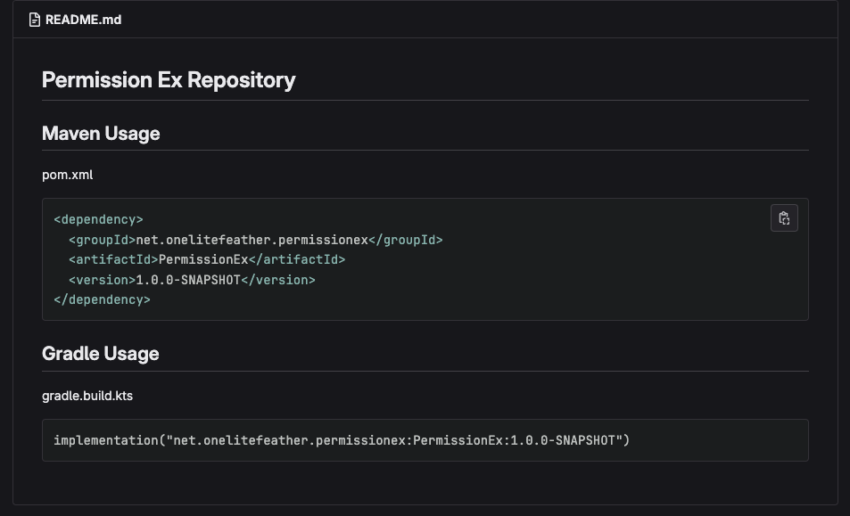
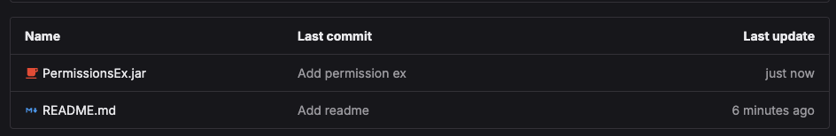

# Intro
Grade in der Minecraft Entwicklung ist es der Fall, das oft Entwickler auf grund der Close Source Entwicklung die API als eigen Jar Datein via Discord oder anderweitig bereitstellen. 
Wenn man jetzt aber ein hoch Automatisiertes Team hat oder generell auf [CI/CD](https://de.wikipedia.org/wiki/CI/CD) setzt ist sowas unpraktikabel oder sieht einfach nicht Hübsch im Repo aus.

Ein Gutes Beispiel ist das 10 Jahre alte Projekt [Vault](https://github.com/MilkBowl/Vault), dort gibt es ein [Lib](https://github.com/MilkBowl/Vault/tree/master/lib) ordner der Externe Abhägigkeiten als Jar ein Bindet.

Das ist keinenfall Praktisch geschweige Sinvoll und fällt in manchen Teilen im Internet in die Kategorie [Anti-Pattern](https://de.wikipedia.org/wiki/Anti-Pattern) der Programmierung. 

Um diesem Anti-Pattern jetzt entgegen zu wirken oder einfach die CI/CD Automatisierung aufrecht zu erhalten ist es Wichtig solche Problem aus dem Weg zu gehen. Maven hat dazu eine Praktisches Tooling in der CLI und kann für sowas verwendet werden. 

Da mein Wissen Prinziepiel in Gitlab bezüglich CI/CD sehr groß ist, konzentrieren wir uns auch hier nur darauf.

## Sicherheit!

Ich möchte kurz dazu auch das Bewusstsein aufbauen, das Manuell Deployte Jar dateien ohne Security Audit generell Schadhaft sein können und ganze Projekt und mehr Infizieren können. Es gibt Toolings in der Welt die teile davon abfangen generell rate ich davon ab. Der Grund Dahinter ist einfach Manche Teams habe weder die Kapazität oder Zeit sich in das Thema Tief einzuarbeiten geschweige eine Schulung besucht. Aus dem Grund sollte man solche Sachen wie oben, nur von Fachtechnischen Personen durchgeführt werden oder von einer die zumindest in Stande ist es nachzuvolziehen. **Also Passt auf von wem ihr Jar dateien verwendet und wie ihr Sie verwendet!**

Genrne könnt ihr [hier](https://blog.onelitefeather.net/de/alles-was-man-ueber-ethanol-wissen-sollte/) dazu mehr lesen!

# Wie Deploye ich die Jar in meinem Gitlab ? 
In Gitlab können wir ganz einfach die [Package Registry](https://docs.gitlab.com/ee/user/packages/package_registry/) verwende, das ist Gitlab eigen Implementierung von einem Maven Nexus nur direkt an Projekten gebunden. Die Package Regsitry kann mehr als nur Maven/Java aber wir Konzentieren uns erstmal nur auf Maven. 


## Anlege eines Projektes
Um die Jar Datei als Repository bereitzustellen müsst ihr Volgenden Dialog öffnen bei euren Gitlab oder bei Gitlab.com

Hier ein beispiel bild:


Dort tragt ihr eure namen des Projektes ein, in unserem Fall: `PermissionsEx-Repository`

Danach ändern wir die Readme zu was sinvollen, am besten Package, Artifact ID und Version.

z.b. so:



In dem Projekt tut ihr dann auch direkt die Jar datei hochladen das die Jar in der Gleiche höhe der Ordner Struktur wie die Readme ist.

Hier das bild dazu:


## Pipeline und Maven

Nun kommen wir zum Spannenden Teil, wir erstellen unsere Pipeline die uns das in Gitlab Registry pusht.

Dazu erstellen wir wie darunter zu sehen, eine `.gitlab-ci.yml` Datei.
Die hat folgende inhalt:
```yml
---
variables:
  MAVEN_IMAGE: "maven:3.9-eclipse-temurin-21-alpine"
  GROUP_ID: "net.onelitefeather.permissionex"
  ARTIFACT_ID: "PermissionEx"
  VERSION: "1.0.0-SNAPSHOT"
  FILE_PATH: "./PermissionEx.jar"

stages:
  - deploy

deploy:
  image: "$MAVEN_IMAGE"
  stage: deploy
  tags:
    - saas-linux-medium-amd64
  script:
    - mvn deploy:deploy-file -DgroupId=$GROUP_ID -DartifactId=$ARTIFACT_ID -Dversion=$VERSION -Dpackaging=jar -Dfile=$FILE_PATH -DrepositoryId=gitlab-maven -Durl=${CI_API_V4_URL}/projects/${CI_PROJECT_ID}/packages/maven -s ci_settings.xml
  rules:
    - if: $CI_COMMIT_REF_NAME == $CI_DEFAULT_BRANCH
    - if: ($CI_COMMIT_BRANCH == 'main' ||  $CI_COMMIT_BRANCH == 'master') && $CI_COMMIT_TAG
    - when: manual
```